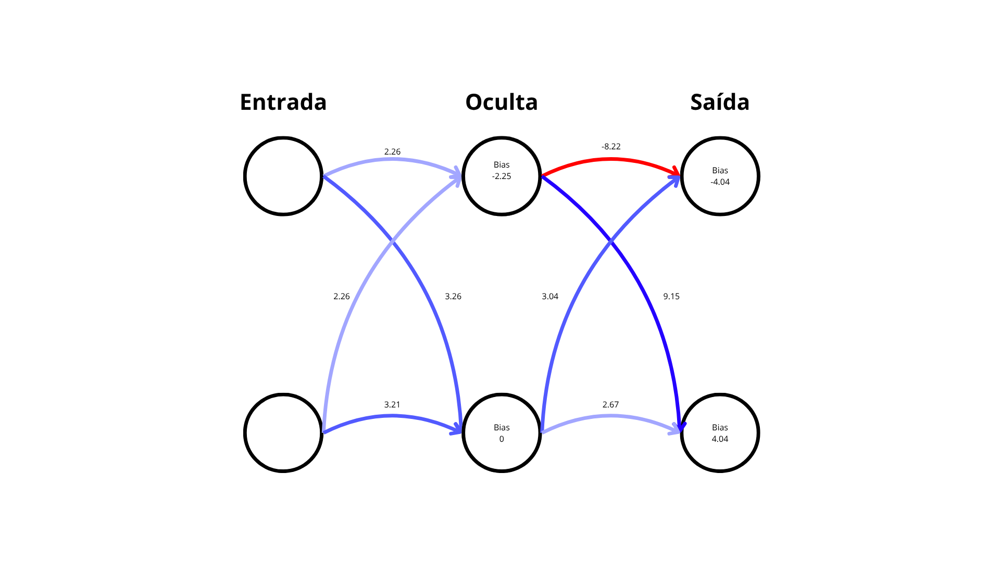

# Biblioteca de Rede Neural em C++ 
Uma biblioteca C++ leve e flexível para construir, treinar e implantar redes neurais totalmente do zero - sem frameworks pesados - com foco em simplicidade e aprendizado.

- Público-alvo: pessoas curiosas em ML que preferem entender os bastidores e testar em C++.
- Experimente primeiro: rode o pAInt, veja-o funcionando, e depois crie sua própria rede.

---

## Funcionalidades
- **Modelo Sequencial**: defina a topologia camada por camada.
- **Camadas de Saída Especializadas**:
    - `LMSE` (Linear Mean Square Error): regressão.
    - `SCE` (Softmax Cross-Entropy): classificação.
- **Funções de Ativação**: `nn::ReLU`, `nn::tanh`, `nn::sigmoid` ou crie a sua (adicione função, derivada e nome em `nn::func`)
- **Otimizador Adam**: Treinamento eficiente e moderno com o otimizador Adam, que ajusta a taxa de aprendizado de forma adaptativa.
- **Treinamento com Validação**: Monitore o `loss` em um conjunto de validação para evitar *overfitting* e salvar o melhor modelo.
- **Persistência de Modelo**: Salve os modelos treinados em arquivos de texto legíveis e carregue-os posteriormente para fazer previsões.

---

## Requisitos e instalação
- **Compilador**: C++17+ (GCC/Clang/MSVC).
- **Build**: CMake 3.15+.
- Testado em Linux. Windwos/macOS são bem-vindos via PR.

Compile (Linux).
```bash
chmod +x scripts/build.sh
./scripts/build.sh
```

---

## Brinque primeiro: pAInt (reconhecedor de dígitos no terminal)


*Exemplo do programa pAInt*

Execute:
```bash
./build/pAInt
```
A rede (carregada de `data/models/number_rec_model.txt`) analisará seu desenho em tempo real e mostrará as probabilidades para os dígitos 0-9.
> Dica: como foi treinada no [MNIST](https://github.com/cvdfoundation/mnist.git), faça traços mais grossos e desenhe mais próximo da parte inferior da tela para melhores resultados.

Quer ver um teste automático? Rode:
```bash
./build/exemplo
```
Esse programa faz previsões em 10.000 imagens do [MNIST](https://github.com/cvdfoundation/mnist.git) (não usadas no treinamento).

---

## Comece rápido: XOR em poucas linhas
```Cpp
#include <iostream>
#include <vector>

#include "rede_neural.h"

int main()
{
    // Topologia: 2 entradas, 2 ocultos, 2 saídas (classificação com SCE)
    nn::Sequencial rede({2, 2, 2}, "SCE", nn::ReLU);

    std::vector<nn::Vetor> X = {{0,0}, {0,1}, {1,0}, {1,1}};
    std::vector<nn::Vetor> Y = {{1,0}, {0,1}, {0,1}, {1,0}}; // one-hot

    // Treino + validação (apenas para demonstração)
    rede.train(
        X, Y,   // treino
        X, Y,   // validação
        0.01,   // taxa de aprendizado
        100,    // janela para parada
        0.001,  // perda (loss) alvo
        1e-6,   // threshold (estabilização)
    );

    // Inferência
    for (const auto& x: X)
    {
        auto p = rede.feed_forward(x);
        int cls = (p[0] > p[1]) ? 0 : 1;
        std::cout << "Entrada: [" << x[0] << "," << x[1] << "] -> "
                  << "p=[" << p[0] << "," << p[1] << "], classe=" << cls << std::endl;
    }

    // Salve o modelo
    rede.salvar_rede("modelo_xor.txt");
}
```
Nota: usar o mesmo conjunto para treino e validação é apenas para fins didáticos.

---

## Referência rápida da API

`nn::Sequencial`

- Construtores
    - `Sequencial(topologia, camada_saida_str, ativ_oculta)`
        - **topologia**: [in, h1, ..., out].
        - **camada_saida_str**: `"LMSE"` ou `"SCE"`.
    - `Sequencial(caminho_modelo)`
        - Carrega uma rede salva (ver persistência).

- Métodos principais
    - `train(train_X, train_Y, val_X, val_Y, lr, janela, perda_alvo, threshold)`
    - `feed_forward(x) -> Vetor`
    - `calc_loss(X, Y) -> double`
    - `calc_accuracy(X, Y) -> double`
    - `salvar_rede(caminho) -> bool`
    - `carregar_rede(caminho) -> bool`

- Notas
    > `nn::Vetor`: vetor 1D de valores (double).
    
    > Para `SCE`, use rótulos **one-hot**

---

## Persistência de modelo

* Salvar:

```Cpp
rede.salvar_rede("meu_modelo.txt");
```

* Carregar:
```Cpp
nn::Sequencial rede_carregada("meu_modelo.txt");
// ou
rede_carregada.carregar_rede("meu_modelo.txt");
```

O formato é legível e inclui topologia, pesos e biases.

---

## Formato de descrição de rede (DSL)
Uma sintaxe simples para descrever redes em arquivo de texto.

| Comando | Parâmetros | Descrição |
| :-----: | :--------: | :-------- |
| `CAMADA` | i n       | Cria a camada `i` com `n` neurônios (`0` = entrada). |
| `ATIVACAO_SAIDA` | Tipo | `SCE` (Softmax + CE) ou `LMSE` (Linear + MSE). |
| `ATIVACAO_OCULTA` | Tipo | `ReLU`, `sigmoid`, `tanh`. |
| `BIAS`  | i B0 B1 ... BN | Define os biases da camada `i`. |
| `LIGACAO` | de_camada de_neuronio para_camada para_neuronio peso | Cria uma conexão com peso. |

>Linhas iniciadas com `#` são comentários.

>Exemplo em `data/models/xor_model.txt`. A imagem abaixo demonstra a topologia:



---

## Qual saída usar?

| Saída | Uso típico | Ativação | Loss | Rótulos esperados |
| :---- | :--------- | :------- | :--- | :---------------- |
| LMSE (Linear + MSE) | Regressão | Linear | MSE | Valores contínuos |
| SCE (Softmax + CE) | Classificação | Softmax | Cross-Entropy | One-hot |

---

## Roadmap e limitações

- Sem GPU por enquanto; CPU apenas.
- Sem camadas convolucionais (foco no sequencial denso).
- Prioridades futuras:
    - Mais funções de ativação.
    - Exemplos e CMake para Windows/macOS.

---

## Feito com essa biblioteca

Projetos criados usando esta biblioteca. Se você fez algo legal, abra um PR e adicione aqui!

| Projeto | Descrição | Link |
| ------- | --------- | ---- |
| **pAInt** | Reconhecedor de dígitos desenhados no terminal, treinado com MNIST | [Ver no repositório](src/pAInt.cpp) |
| **Exemplo MNIST** | Avaliação de 10.000 imagens do MNIST | [Ver no repositório](src/exemplo.cpp) |

> Para adicionar seu projeto:
> - Nome do projeto
> - Breve descrição (1 linha)
> - Link para o repositório
> - (Opcional) imagem ou GIF demonstrativo

---

# Neural Network Library in C++

A lightweight and flexible C++ library to built, train, and deploy neural networks from scratch - no heavy frameworks required. Designed for curious minds who want to explore machine learning in C++.

- Target audience: ML enthusiasts who prefer to understand the inner workings and experiment beyound Python.
- Try it first: run **pAInt**, se it in action, then build your own network.

*(English version mirrors the Portuguese content above - see sections for features, installation, examples, API, DSL, and roadmap.)*